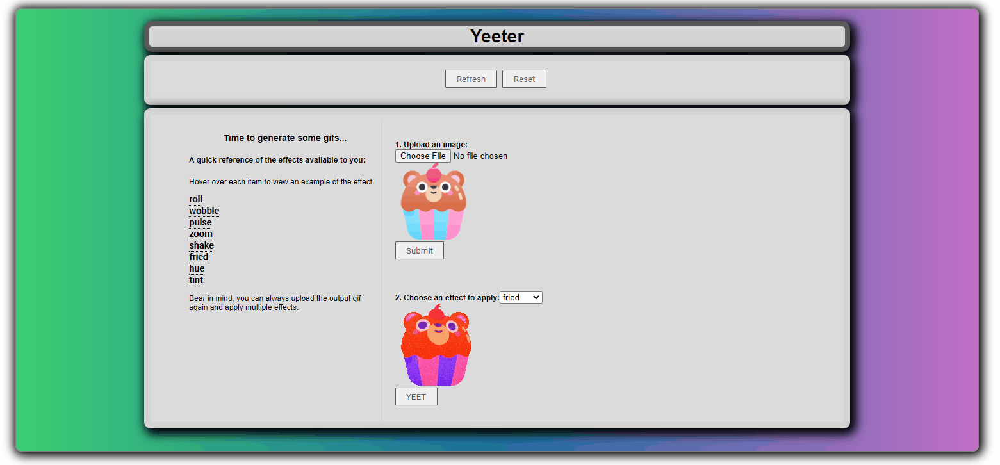

# Yeeter #

A simple NodeJS Express frontend for [yeetgif](https://github.com/sgreben/yeetgif)

## Requirements ##

`docker` and `docker-compose` installed on your system, and a browser of your choice.

## Usage ##

Run `docker-compose up` in the project's base directory and wait for the image to build.

Then, go to `localhost:3000` in your browser :)

